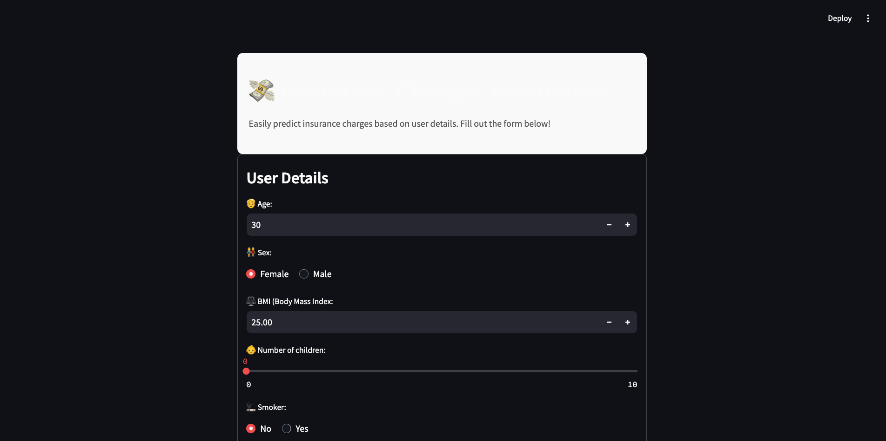

# Insurance Prediction App (Streamlit)

# Insurance Prediction
This project provides a Streamlit application for users to input insurance-related features and receive predictions from a FastAPI backend.

## Table of Contents
- [Description](#description)
- [Requirements](#requirements)
- [Getting Started](#getting-started)
- [Usage](#usage)
- [Example Input and Output](#example-input-and-output)
- [File Structure](#file-structure)
- [License](#license)

## Description

The Streamlit application provides an interactive web interface for predicting insurance costs based on user inputs. The prediction model uses a machine learning model served by a FastAPI backend, which processes inputs such as:

- Age
- Gender
- BMI
- Number of Children
- Smoker Status
- Region

The Streamlit app fetches metadata (labels and encoding) for sex, smoker, and region from the FastAPI backend and uses it to populate input fields dynamically.


## Requirements
To set up and run this project, you’ll need the following Python packages:

- `scikit-learn`
- `pandas`
- `joblib`
- `numpy`
- `streamlit`

You can install these dependencies by running:
```bash
pip install -r requirements.txt
```

## Getting Started
Follow these steps to set up and run the project.

1. Ensure the FastAPI server is running on `http://127.0.0.1:8000`
2. Declare the `base_url` to your API in the `.env` file e.g. `BASE_URL=http://127.0.0.1:8000`
3. Run Streamlit
The Streamlit app allows users to input values and retrieve predictions from the FastAPI server. To start Streamlit, run:
  ```bash
  streamlit run app.py
  ``` 
The Streamlit app will open in a browser window at `http://localhost:8501`.

## Usage

Streamlit Frontend


- Input insurance features in the provided fields. 
- Click the Predict button to get the prediction. 
- The prediction will display predicted insurance charges.
  
### Streamlit Application

The Streamlit app provides an interface for users to input feature values and get predictions. When the Predict button is clicked, the app sends the data to the FastAPI server and displays whether the predicted insurance charges.

## Example Input and Output
Example Input:

Age = 45  
Gender = Female 
BMI = 28.7 
Number of Children = 2
Smoker Status = Yes  
Region = Southeast 

Example Output:

Predicted Insurance Charges: $17,900.55 


## File Structure
The project directory is structured as follows:

```
📦 XGBoostRegressorFrontend
├─ src
├─ .env
├─ .gitignore
├─ app.py
├─ README.md
└─ requirements.txt
```
## License
This project is licensed under [](https://opensource.org/licenses/MIT)